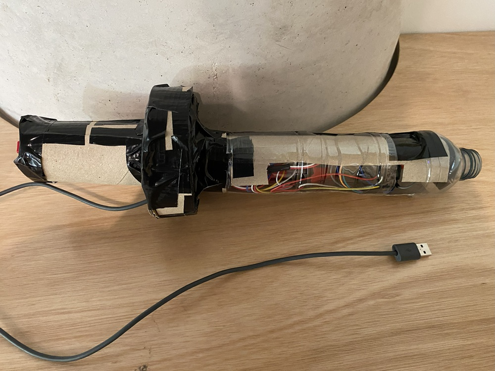
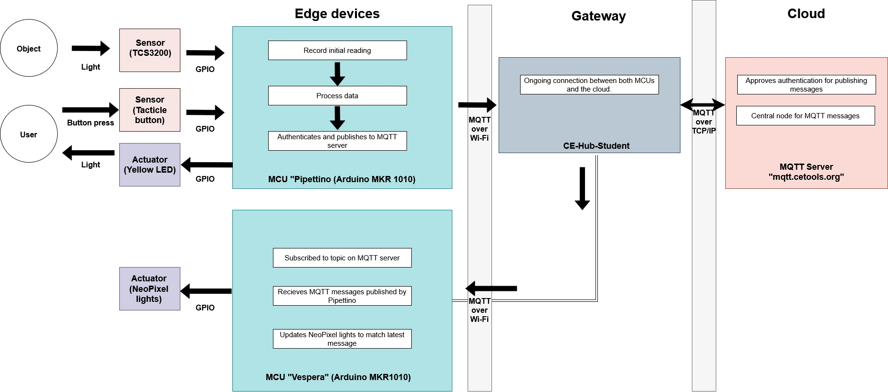
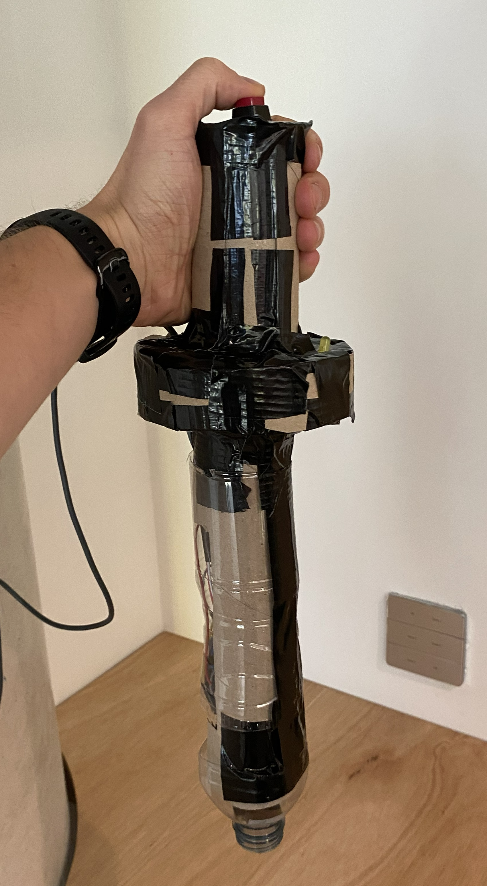
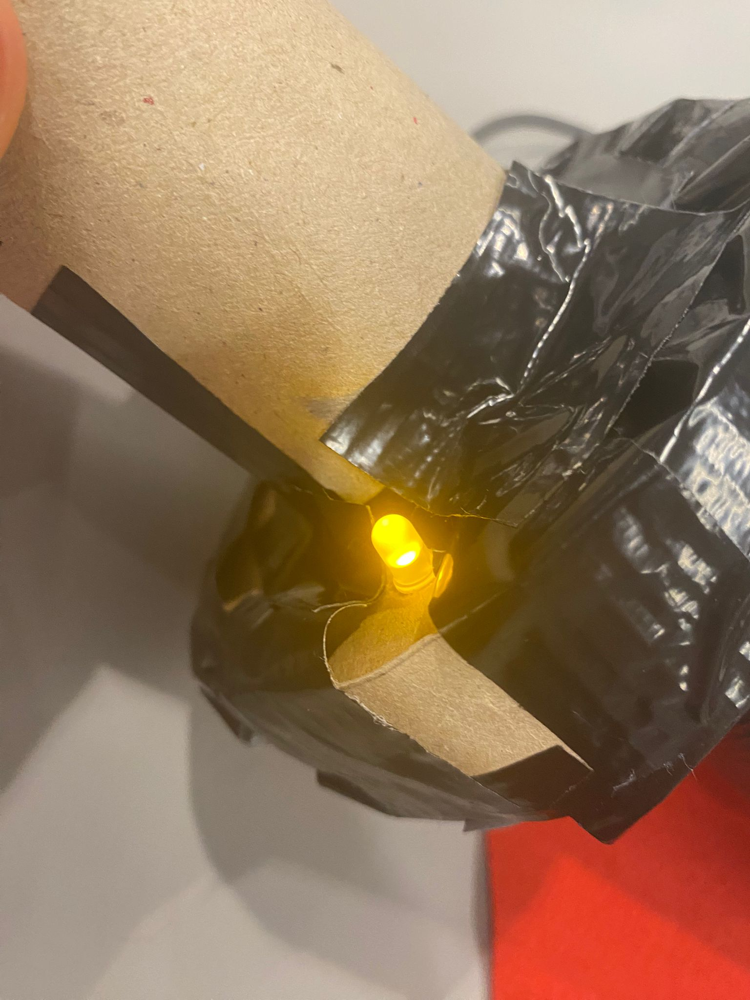
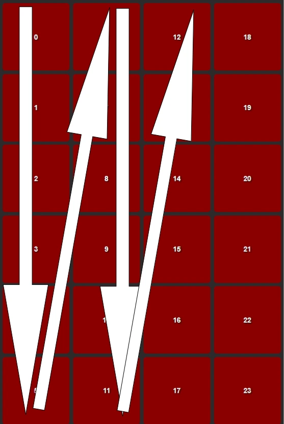
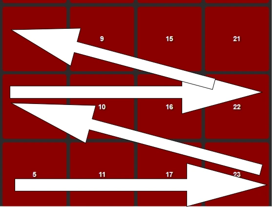

# Pipettino
Pipettino is a portmanteau of the nouns "Pipette" and "Arduino". Pipettes, or eyedroppers, are a staple icon of colour pickers in any modern graphics software.
By combining this iconography with the computing power of an Arduino, one may bring forth this previously digital-only utility into the physical realm.

    

## What's in this repository?
Pipettino is an Arduino MKR1010-powered interface to control an electric light unit, [Vespera](https://github.com/ucl-casa-ce/casa0014/tree/main/vespera), by sending MQTT messages over Wi-Fi. 

This repository contains the following resources on Pipettino:
- Pipettino's source code.
- Test scripts used in the development of Pipettino.
- A list of hardware and software required to make the device.
- Instructions on how to reproduce this device yourself.
- Photos of concept sketches and in-progress builds of Pipettino. 

## How does it work?

Pipettino is a remote sensing device connected to the edge of an Internet of Things network. This device is made of the following components:
### Microcontroller (MCU)
- Arduino MKR1010
### Sensors
- TCS3200 Colour Sensor
- Tactile switch (used as a button)
### Actuator
- Yellow LED

    

Pipettino can detect the frequency of red, green and blue lightwaves reflected off objects into its "tip" using its colour sensor. When the button is pressed (see below image) the MCU reads this data sent from the colour sensor, processes it on-device ([see here for details](#colour-detection-technical-details)) so that it is readable by Vespera, and publishes this colour data as a MQTT message to a Wi-Fi gateway.

    

When Pipettino is publishing a message or initially connecting to the MQTT server, it is unable to receive input from the colour sensor. The MCU registers this and turns on the yellow LED actuator. This communicates to the user that the device is busy - it will be unresponsive for the duration of communication activity.

    

The Wi-Fi gateway delivers the message to an MQTT server, `mqtt.cetools.org`, in the cloud, where it is published to the topic `student/CASA0014/light/24`.

Vespera is also subscribed to this topic on the same MQTT server. When Pipettino's message is published, Vespera changes the colour of its light to match the newly-published colour data.

You can also view Vespera's lights chaing using this remote [this web viewer](https://www.iot.io/projects/lumi/) on topic 24.

## How can I reproduce this device?
Please read the instructions outlined in [BUILD.md](https://github.com/ethan-se/pipettino-casa0014/blob/main/BUILD.md), outlining the software and hardware components for this device and how to assemble them.

## Known issues:
### Unintended payload sent on startup
As soon as Pipettino recieves power, it immediately reads data from the colour sensor and sends an initial batch of 71 payloads via MQTT.

This bug was introduced in [commit e2b06bc](https://github.com/ethan-se/pipettino-casa0014/commit/e2b06bcca82506d67645a6c28b0ba93076a7b6b4). I suspect it has something to do with the implementation of the tactile button code, which was pushed in this commit. 

### High latency when publishing messages
The code responsible for publishing MQTT messages updates one light on Vespera per payload. This allows for an animated effect where the light gradually appear to change colour. However, it is also slow.

The yellow LED is a workaround to let users know that the device is busy. If I had time, I would rewrite this publishing code to change all lights simultaneously. This would allow for a more responsive user experience and eliminate the need for a LED.

### Weak secondary colour readings
Any secondary colour (i.e. cyan, magenta, yellow) is displayed as much paler on Vespera compared the originally scanned colour. I was unable to fix this without breaking the calibration of the primary colours.

If given more time, I would try the following approaches:
- Recalibrate the colour sensor using the 2% scaling configuration, instead of 20%. 
    
    This would output a wider range of readings, which might create a bigger difference between strong and weak colour readings. Mixed colours would appear bolder.
- Experiment with other ways of remapping the sensor readings to RGB format, outside of `map()`.
- Make use of the TCS3200's ability to sense all light (like a normal photodiode), which goes unused in this project.

    If Vespera or another light display could recieve RGBW values, this could potentially correct for poor colour brightness.

## Areas for improvement
### Improve "flow" of data to Vespera
When Pipettino publishes to MQTT, it updates one pixel at a time in index order of each of the lights. The pattern resembles the following diagram:

    

A better way to implement this would be to change the order of the lights being lit, so that Vespera "fills up" with colour from the bottom light to the top. This new pattern would resemble this diagram below:

    

### Make the device wireless
This prototype is currently powered using a long USB cord connected to mains power supply. A more refined prototype would have a LiPo battery fitted to become truly wireless, improving the user experience.

## Colour detection: technical details
The `pulseIn()` function measures the time taken for one pulse to complete, in microseconds, as outlined in the [Arduino documentation](https://docs.arduino.cc/language-reference/en/functions/advanced-io/pulseIn/).

There is a reciprocal relationship between a wave's frequency and how long it takes for a wave to complete one cycle, as described by the following equation:

$$
T = \frac{1}{f}
$$
Where $T$ is the wave's duration and $f$ is the wave's frequency.

This means when there is a strong presence of a certain colour wavelength reflected into the sensor, the sensor records a low value. Likewise, high values are recorded for a weak presence of colour.

Viewing these raw inputs for red, blue and green light as an RGB values displays the inverted colour to what is being read by the sensor!

To obtain the colour values that best match the colour of the object being recorded, the MCU processes the readings from the colour sensor in two steps:
1. The `map()` function is used to reverse the range of values recorded by the sensor, so that the lowest values (i.e. high amount of colour detected) are displayed as the highest RGB value (255).
2. The `constrain()` function is used on the output of `map()`. This forces values outside below `0` to be `0`, and likewise for values above `255`. This catches any integer overflows.  

## FAQ
### "Why are you using breadboards, headered wires and cardboard?"
This repository is part of an assessed coursework to develop an understanding of developing part of a connected environments system. The brief asks me to build a medium-fidelity prototype in a very short time. Documentation of features, limitations and potential additions given more time are just as important as the device itself here.
### "Why are you using a tactile switch? Why not use a linear one?"
The tactile switch I use is very satisfying to press. It sells the idea of using a giant pipette to pick colours quite well.

## Useful resources
- TCS3200 Colour Sensor documentation from DFRobot, the manufacturer of the breakout board (SEN0101) I used for this project: https://wiki.dfrobot.com/TCS3200_Color_Sensor__SKU_SEN0101_
- A helpful blog bost that gave me ideas on how to calibrate the colour sensor: https://randomnerdtutorials.com/arduino-color-sensor-tcs230-tcs3200/