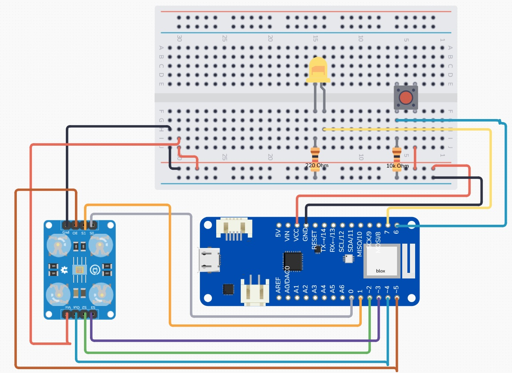

# Pipettino
Pipettino is a portmanteau of the nouns "Pipette" and "Arduino". Pipettes, or eyedroppers, are a staple icon of colour pickers in any modern graphics software.
By combining this iconography with the computing power of an Arduino, one may bring forth this previously digital-only utility into the physical realm.

    

## What's in this repository?
Pipettino is an Arduino MKR1010-powered interface to control an electric light unit, [Vespera](https://github.com/ucl-casa-ce/casa0014/tree/main/vespera), by sending MQTT messages over Wi-Fi. 

This repository contains the following resources on Pipettino:
- Pipettino's source code, in `/src/`
- Test scripts used in the development of Pipettino, in `./test-scripts/`
- A list of hardware and software required to make the device, in `BUILD.md`
- Instructions on how to reproduce this device yourself, in `BUILD.md`
- Photos of concept sketches and in-progress builds of Pipettino, in `./concept/`

## How does it work?

Pipettino is a remote sensing device connected to the edge of an Internet of Things network. This device is made of the following electronic components:
### Microcontroller (MCU)
- Arduino MKR1010
### Sensors
- TCS3200 Colour Sensor
- Tactile switch (used as a button)
### Actuator
- Yellow LED

Pipettino can detect the frequency of red, green and blue lightwaves reflected off objects into its "tip" using its colour sensor. When the button is pressed, the MCU reads the data sent from the colour sensor, processes it on-device ([see here for details](#colour-detection-technical-details)) so that it is readable by Vespera, and publishes it as a MQTT message to a MQTT server via a Wi-Fi gateway.

    

When Pipettino is publishing a message or initially connecting to the MQTT server, it is unable to receive input from the colour sensor. The MCU registers this and turns on the yellow LED actuator. This communicates to the user that the device is busy - it will be unresponsive for the duration of communication activity.

    

The Wi-Fi gateway delivers the message to an MQTT server, `mqtt.cetools.org`, in the cloud, where it is published to the topic `student/CASA0014/light/24`.

Vespera is also subscribed to this topic on the same MQTT server. When Pipettino's message is published, Vespera changes the colour of its light to match the newly-published colour data.

You can also view Vespera's lights change without being physically present, using [this web viewer](https://www.iot.io/projects/lumi/) on topic 24.

### Architecture overview diagram

    

### Circuit diagram

    

## How can I reproduce this device?
Please read the instructions outlined in [BUILD.md](https://github.com/ethan-se/pipettino-casa0014/blob/main/BUILD.md), outlining the software and hardware components for this device and how to assemble them.

## Known issues:
### Unintended payload sent on startup
As soon as Pipettino receives power, it immediately reads data from the colour sensor and sends an initial batch of 71 payloads via MQTT. This is unintended behaviour - Pipettino should remain idle after the initial connection to the MQTT server until the first button press from the user.

This bug was introduced in [commit e2b06bc](https://github.com/ethan-se/pipettino-casa0014/commit/e2b06bcca82506d67645a6c28b0ba93076a7b6b4). Cause unknown, but I suspect it has something to do with the implementation of the tactile button code, which was pushed in this commit.

### High latency when publishing messages
The code responsible for publishing MQTT messages updates one light on Vespera per payload. This allows for an animated effect where the lights gradually appear to change colour. However, it is also slow and reduces responsiveness to subsequent input from the user.

The yellow LED was implemented as a workaround to let users know that the device is busy. If I had time, I would rewrite the MQTT publishing code to change all lights simultaneously. This would allow for a more responsive user experience and eliminate the need for this LED, streamlining the design.

### Weak secondary colour readings
Any secondary colours (i.e. cyan, magenta, yellow) are displayed in a much paler shade on Vespera compared to the original colour of the object. I was unable to fix this without reducing the accuracy of detecting the primary colours.

If given more time, I would try the following approaches:
#### Use alternative settings to output a wider range of raw values from the colour sensor.
The intention behind this change would be to create a bigger difference between strong and weak colour readings. In theory, this would make secondary colours would appear bolder.
#### Experiment with other ways of remapping the sensor readings to RGB format, outside of `map()`.
#### Make use of the TCS3200's ability to detect the frequency of white light.
If Vespera or another light display could recieve RGBW values, this could potentially correct for poor colour brightness.

## Areas for improvement
### Improve the "flow" of data to Vespera
When Pipettino publishes a message to the MQTT server, it updates the colour values of one RGB LED at a time. The LEDs are updated in ascending order, from light `0` to light `71`. This pattern of updates cascades from the top down one column of LEDs at a time, before moving to the top of another column until all lights are the same colour. The following diagram illustrates this pattern of change:

    

A better way to implement this would be to change the order of the lights being lit, so that Vespera "fills up" with colour from the bottom light to the top. Lights would start to change from the bottom row first, changing the entire row before moving to the next row up. This would repeat until all lights change colour. This new pattern would resemble the diagram below:

    

### Make the device wireless
This prototype is currently powered using a long USB cord connected to mains power supply. A more refined prototype would have a LiPo battery installed to become a truly wireless device, improving the user experience.

## Colour detection: technical details
The TCS3200 colour sensor consists of 4 white LEDs and a main sensor unit. It uses the LEDs to cast light on a nearby object. This light is reflected off the object and into the main sensor unit, which detects the frequency of different coloured lightwaves that hit it. 

It uses configurable filters for red, blue and green light. Filters are selected using a combination of HIGH/LOW voltages on two input pins. Only one filter can be selected at each time. This means that the colour properties of a target object have to be recorded at three different instances.

The `pulseIn()` function is used to obtain three initial readings from the colour sensor: one each for red, blue and green light. This function measures the time taken for one pulse of the colour sensor's signal output to complete, in microseconds, as outlined in the [Arduino documentation](https://docs.arduino.cc/language-reference/en/functions/advanced-io/pulseIn/).

In physics, a reciprocal relationship exists between a wave's frequency and the duration of a wave's cycle, as described by the following equation:

$$
T = \frac{1}{f}
$$

Where $T$ is the wave's duration and $f$ is the wave's frequency.

This means when there is a high frequency of red lightwaves being reflected into the sensor (i.e. a very red-looking object!), the sensor outputs a low value. Likewise, the sensor outputs high values when it detects a low frequency of red light.

Earlier in development, I used these raw inputs as RGB values for Vespera without any processing. The result was Vespera displaying the complete inverse colour of the object being scanned by the sensor!

To obtain the colour values that best match the colour of a target object, the MCU processes the readings from the colour sensor in two steps:
1. The `map()` function is used to reverse the range of values recorded by the sensor (estimated using trial-and-error exposure to bright red/blue/green objects) to fit within full range of RGB colours (i.e. lowest sensor reading is mapped to `255`, highest sensor reading is mapped to `0`).
2. The `constrain()` function is used on the output of `map()`. This forces values mapped to below `0` to be set to `0`, and values mapped above `255` to be set to `255`. This catches any integer overflows from unexpectedly high sensor readings.  

## FAQ
### "Why are you using breadboards, headered wires and cardboard?"
This repository is part of an assessed coursework to develop an understanding of developing part of a connected environments system. The brief asks me to build a medium-fidelity prototype in a very short time. Documentation of features, limitations and potential additions given more time are just as important as the device itself here.
### "Why are you using a tactile switch? Why not use a linear one?"
The tactile switch I use is very satisfying to press. It sells the idea of using a giant pipette to pick colours quite well.

## Useful resources
- TCS3200 Colour Sensor documentation from DFRobot, the manufacturer of the breakout board (SEN0101) I used for this project: https://wiki.dfrobot.com/TCS3200_Color_Sensor__SKU_SEN0101_
- A helpful blog bost that gave me ideas on how to calibrate the colour sensor: https://randomnerdtutorials.com/arduino-color-sensor-tcs230-tcs3200/
